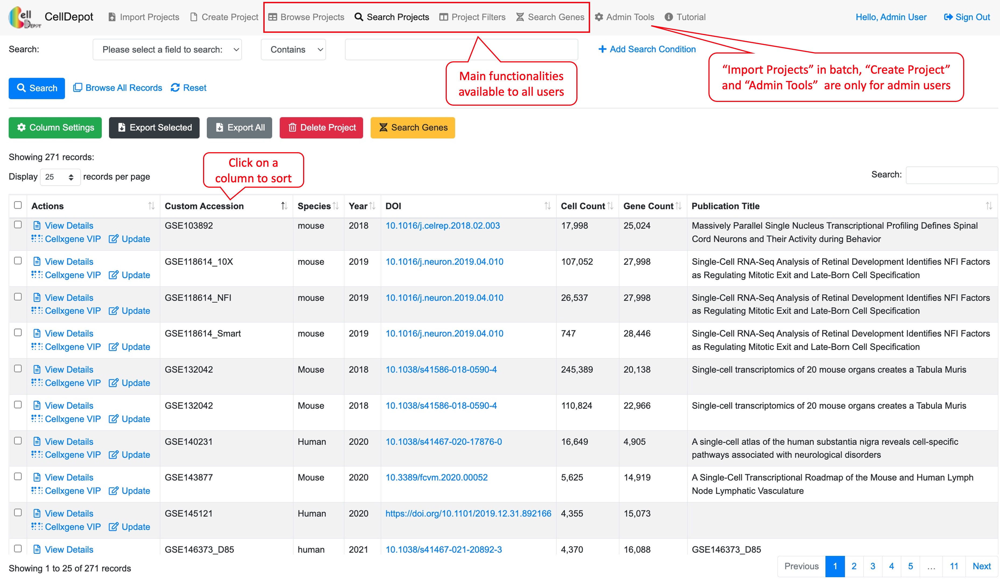
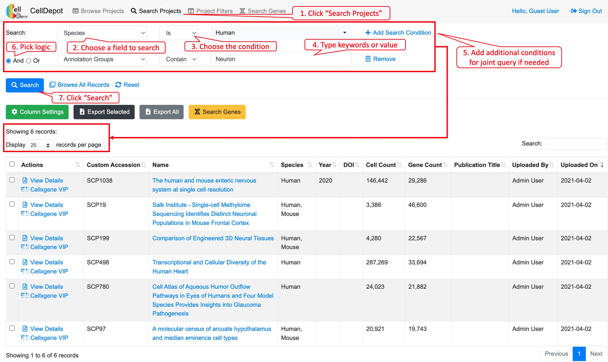
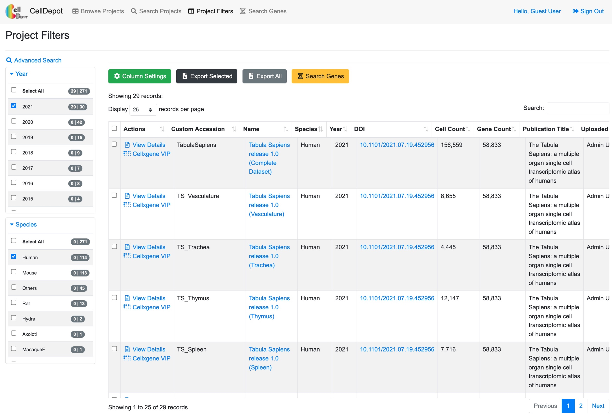
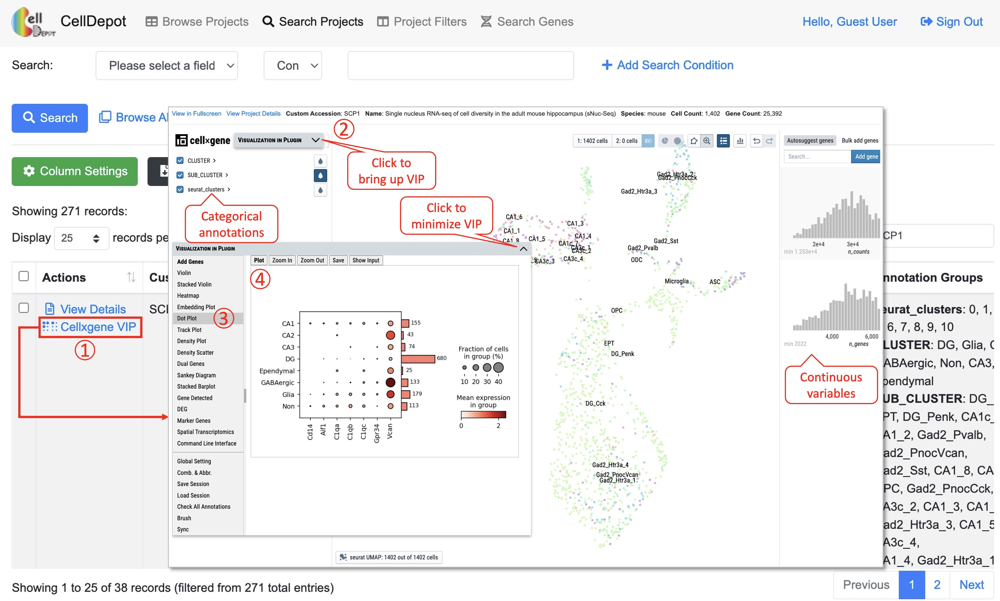
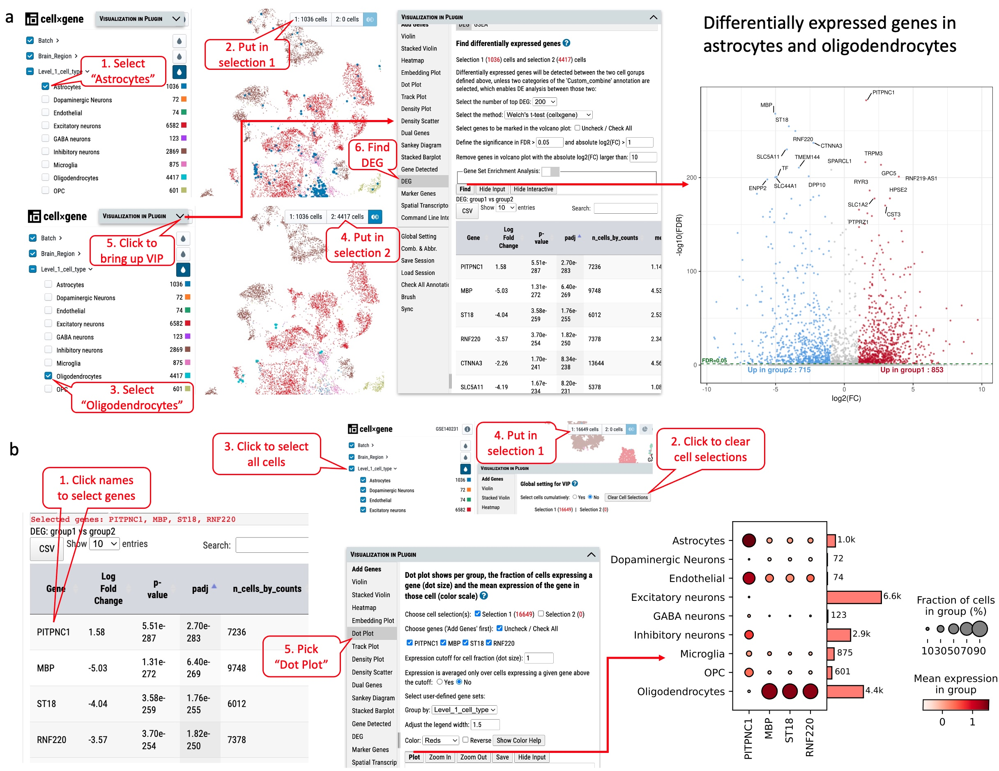
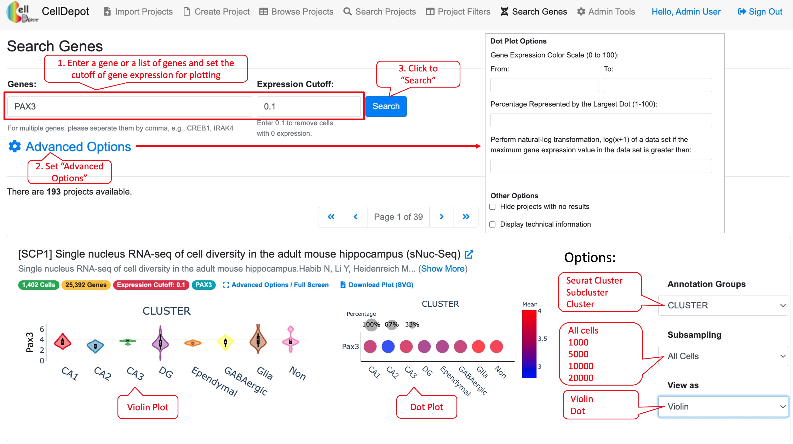
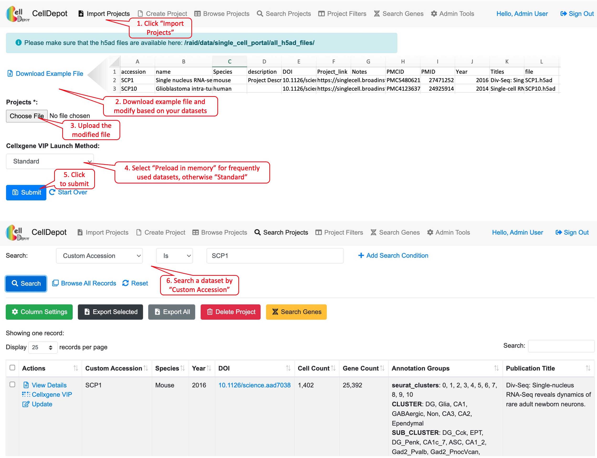

# Supplemental Tutorial {#SITutorial}

CellDepot is a scRNA-seq data portal consisting of a relational database management system, a graphical query builder, and data visualization tools, which can be accessed via the link, http://celldepot.bxgenomics.com for public datasets or a link to private installation, e.g., http://go.biogen.com/CellDepot for Biogen internal data collection. This is the supplemental tutorial providing detailed instructions. Clicking on a figure will bring up the enlarged view.

Figure S1. CellDepot Homepage. Functions designated to different user roles are highlighted in red callout boxes.

The interface contains multiple tabs at the top of the homepage, which correspond to major functionalities of CellDepot. All users can explore the existing datasets loaded in the public CellDepot for visualization and analysis while only admin users can upload datasets to a CellDepot instance, public or private.

## 	Browse Projects
Users can customize columns to be displayed by clicking on the green 'Column Settings' button. In addition, all or selected entries could be exported in CSV format. A quick search box is provided on the top-right corner of the table while building a complex query is exemplified in Figure S3 (\@ref(search)).

Figure S2. Browsing projects in a personalized view.

## Search Projects {#search}
This function allows users to search projects of interest, which can be accessed through the homepage as well. Users can search projects by 17 attributes in multiple logic conditions: annotation groups, cell count, cellxgene VIP launch method, Custom accession, description, DOI, file name, file size, gene count, name, notes, PMC ID, Publication Title, PubMed ID, Species, URL, and/or Year.

Figure S3. Workflow of searching projects by using the graphical multi-logic, multi-condition query builder. Six datasets are identified when searching by 'Species is Human' and 'Annotation Group contains Neuron'.

## Project Filters

This function lists the filtered datasets simply based on AND logic operation of checked items under various categories. It is a friendly feature for first-time users as they may not be familiar with the design of the database to construct more complex query.

Figure S4. The 'Project Filters' page. 29 records are identified by filtering criteria of 'Year' equaling 2021 and 'Species' being human.

## Visualize Datasets
### View Details

The dataset information consists of project summary and annotation groups. The project summary is provided by admin users when uploading projects while annotation groups are retrieved from uploaded h5ad files.

Figure S5. How to view details of a dataset. Steps are outlined by red circled numbers.

### Data Visualization and Analysis by cellxgene VIP {#figures6}
CellDepot is not only a database management system, but also a web portal for visualizing and analyzing scRNA-seq datasets through embedded cellxgene VIP tool. By clicking 'cellxgene VIP' to access functional modules on the menu, users can perform advanced data visualization and analysis. To learn how to use cellxgene VIP, please go to https://interactivereport.github.io/cellxgene_VIP/tutorial/docs/how-to-use-cellxgene-vip.html.

Figure S6. Visualization and analysis of a scRNA-seq dataset by cellxgene VIP.

### Case Study 1

Exploration and visualization of differentially expressed genes (DEGs) between two types of cells.

As shown in Figure S7a, two types of cells, Astrocytes (1036 cells) and Oligodendrocytes (4417 cells) are selected. By running differential gene expression analysis with one of the built-in statistical methods such as Welch's t-test, we detected 1578 (DEGs), including 715 up-regulated and 853 down-regulated genes in astrocytes compared to oligodendrocytes (Figure S7a). The expression of the top four DEGs among the cell types indicates that gene MBP, ST18 and RNF220 are expressed explicitly in oligodendrocytes, while gene PITPNC3 is expressed mainly in astrocytes and endothelial cells (Figure S7b).

Figure S7. Exploration of differentially expressed genes in dataset GSE140231 through cellxgene VIP. (a) Identifying differentially expressed genes in astrocytes and oligodendrocytes. (b) The expression of top four genes in various cell types as shown in dot plot.

## Search Genes

This tab allows searching on genes of interest with the expression cutoff. The search outcome provides users a list of projects in which genes of interest are expressed above the cutoff.  Each project displays a link to project page and a plot if applicable. This plot can be either a violin plot or dot plot showing the gene expression level in a selected annotation group. Further, under "Advanced Options", users can define the range of expression color scale and the percentage represented by the largest dot to have expression data from various projects plotted in a unified manner. 

Figure S8. Steps to find gene expression level of a gene in projects under 'Search Genes' tab. The final plot can be customized by available options listed in red callout boxes on the left side.

### Case Study 2

Cross-project comparison of skeletal muscle marker genes PAX3, PAX7, PITX2, MYF5, MYF6, MYOD1, MYOG, NEB, and MYH3 among the datasets whose species is human and cell type is myogenic.  

Figure S9. Workflow of conducting the cross-project comparison of a list of genes among the selected datasets.

## Import Projects {#import}
The functionality is limited to admin users. To upload new projects to CellDepot database in batch, two types of files are required: 1) .h5ad files and 2) project information file in CSV (Comma Separated Values) format. First, the prepared h5ad files are required to be copied to a folder defined in the configuration file, e.g., /data/celldepot/all_h5ad_files/. Afterwards, admin users navigate to the CellDepot home page, click ‘Import Projects’ at the top menu, then ‘Download Example File’ to fill in meta information of datasets into the downloaded template for submission. In addition, there are two cellxgene VIP launch modes to chosen from, 'Standard' and 'Preload in Memory'. 'Standard' mode is for infrequently used datasets while 'Preload in Memory' should be selected to speed up loading and responding time of frequently used large datasets.
After the metadata file is uploaded, CellDepot will automatically convert the dataset to CSC format if needed through a cron job (\@ref(cron)). To explore the detail of imported datasets, users can enter ‘Browse Projects’ page and then search these datasets by user assigned 'Custom Accession' identifiers.

Figure S10. Workflow of how to import new datasets.

## Create Project
Besides batch uploading under "Import Projects" tab, admin user can use the online form under this tab to submit information of a project.

## Update a Project
Project information including launch mode can be modified by admin users by clicking on 'Update' link of a project under 'Actions' column in the table.

