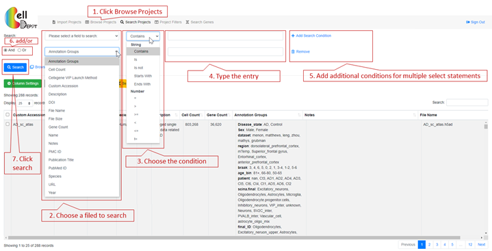
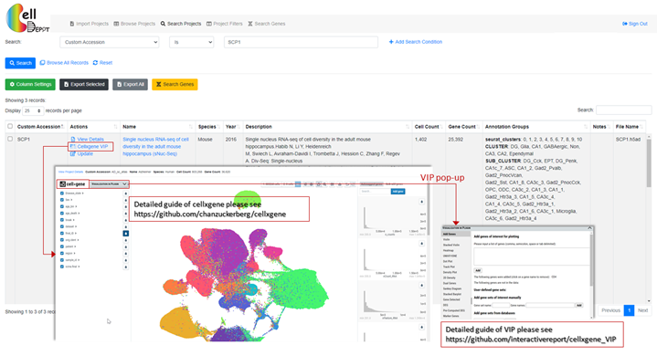

# Supplemental Tutorial {#SITutorial}

CellDepot is database management system integrated with management system, query searching and data visualization tools for scRNA-seq datasets, which can be accessed by the link http://celldepot.bxgenomics.com and Biogen internal link http://go.biogen.com/CellDepot. This is a supplemental tutorial providing a detailed guide.


The interface contains multiple tabs, corresponding to import and/or select objects in CellDepot scRNA-seq database, that can be accessed on top panel of the webpage. Users can upload their own dataset or explore the existing datasets for visualization and analysis.

## 	Browse Projects
### Search Projects {#search}
This function allows the user to search any targeted interests, which also can be accessed through search projects on the top panel of the webpage. Users is allowed to select the projects by 17 attributes: annotation groups, cell count, cellxgene VIP launch method, Custom accession, description, DOI, file name, file size, gene count, name, notes, PMC ID, Publication Title, PubMed ID, Species, URL, Year. These 17 fields can also be (partially) displayed on the webpage through ‘column setting’ on the webpage. Users can also search projects by the keywords via the search function on the right of the webpage. In addition, by ‘column setting’, users can set up the customized layout of targeted projects; thereby exporting to csv format.



#### Case study 1

Six datasets are filtered when searching by ‘Species is Human’ and ‘Annotation Group contains Neuron’.


#### Case Study 2

Cross-project comparison of skeletal muscle marker genes PAX3, PAX7, PITX2, MYF5, MYF6, MYOD1, MYOG, NEB, and MYH3 among the datasets whose species is human and cell type is myogenic.  


For each project, users can view the datasets information, visualize data analysis, and conduct update through clicking on “View Details”, “cellxgene VIP”, and “Update” links, respectively. 

### Project Filters

This page provides the matched datasets by simply clicking the categories. It is a first-time user-friendly functionality as users may not be familiar with the content of the database. The advance search function is the same as that on the ‘Browse Projects’ page (\@ref(search)).


## Visaulize Datasets
### View Details

The datasets information consists of project summary and annotation groups. The project summary is provided by each user when uploading projects. The information of annotation groups is retrieved from uploaded .h5ad file.


### Update

Project summary information can be updated on ‘Browse Project’ page with ‘Preload in Memory’ cellxgene VIP launch method via click ‘Update’ hyperlink.


### Data Visualization and Analysis
CellDepot is not only a database management system, but also a web portal to visualize the scRNA-seq dataset. Here, we embed cellxgene and cellxgene VIP in CellDepot.  By clicking ‘Cellxgene VIP’, data analysis results can be visualized. Detailed guides of cellxgene and cellxgene VIP, please go to https://interactivereport.github.io/cellxgene_VIP/tutorial/docs/.



#### Case study 1

Exploration and visualization of the expression of gene(s) across the cluster of cells under various conditions.

As shown in Figure S10a, two cell groups from Astrocytes (1036 cells) and Oligodendrocytes (4417 cells) are selected. By running differential analysis with one of the built-in statistical methods such as Welch’s t-test, we detected 1578 differential expressed genes (DEGs), including 715 up-regulated and 853 down-regulated genes in astrocytes compared to oligodendrocytes (Figure S10a). The expression of the top four DEGs among the cell types indicates that gene MBP, ST18 and RNF220 are expressed explicitly in oligodendrocytes, while gene PITPNC3 is expressed mainly in astrocytes and endothelial cells (Figure S10b). In the future, we plan to add other multi-omics data modalities, which can be incorporated and integrated with scRNA-seq, such as spatial transcriptomics and scATAC-seq data. 


## Search Genes

This tab allows searching on targeted genes with cell count cutoff and expression cutoff. The search outcome provides users every project contains the targeted genes.  Each project displays a link to project page and a figure plot if applicable. This plot can be either violin plot or dot plot shows the gene expression level in each annotation groups.


## Upload Projects {#upload}
To upload new projects in CellDepot database, two files are required: 1) .h5ad files and 2) project information in csv format. Detailed formatting guidance can be found by ‘Download Example File’ hyperlink on webpage. In addition, two cellxgene VIP launch methods are provided: standard and preload in memory. Standard mode is for the first-time imported datasets, while preload in memory should be chosen when users update the meta information of datasets. 
After the projects are submitted, CellDepot will automatically analyze the datasets. To explore the detail of uploaded datasets, users can navigate to ‘browse projects’ page and then search the imported datasets by the customized accession number. 


## How to set up cron job? {#cron}
The following cron job entry is needed to convert h5ad file to CSC format on the background,
```{bash, eval=FALSE}
@hourly <user-name> cd /var/www/html/celldepot/app/core; php ./api_toCSCh5ad.php
```

Please make sure that the user has the permission to write in the data directory.


